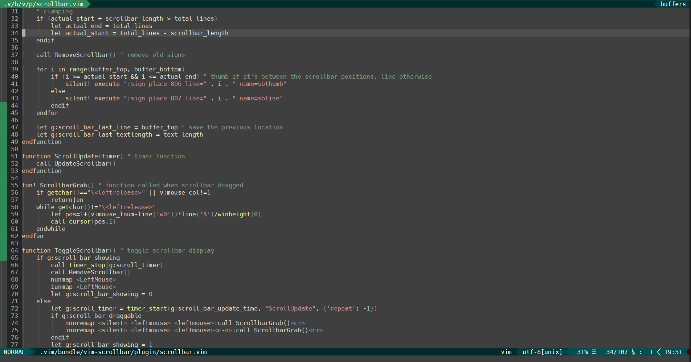

# vim-scrollbar
Adding a scrollbar to terminal vim using "signs". Inspired by [lornix/vim-scrollbar](https://github.com/lornix/vim-scrollbar), which, for some reason, doesn't work for me at all. This works by updating on a timer, so it'll work for any motion without changing your keybindings, with the tradeoff of being less smooth when scrolling continuously (requires Vim 8 due to the timer function). You can set the update frequency to balance smoothness with slowing other things down (I can actually set the timer pretty low without noticing any slowdowns, but there are diminishing returns and it still jumps around a bit when scrolling using the mouse wheel). It only shows when using terminal vim, of course, since gVim has its own scrollbar.

## Usage

Use `:ToggleScrollbar` to toggle it (by default, it starts automatically). You can also use `:ScrollbarOn` and `:ScrollbarOff` to set the state. If `g:scroll_bar_draggable` is on, you can drag the scrollbar to scroll to a position in the buffer (code is based on an answer to [this question](https://superuser.com/questions/276334/scroll-bar-for-vimcurses-based-one-not-gvim)).

## Install

Download _plugin/vim-scrollbar.vim_ and source it in your .vimrc, or use your favourite plugin manager. 

For example, with [Vundle](https://github.com/VundleVim/Vundle.vim):

~~~vim
Plugin 'zarainia/vim-scrollbar'
~~~

## Settings

Set the amount of time between updates (default is 100):

~~~vim
let g:scroll_bar_update_time=100
~~~

Set the scrollbar thumb and line symbols (defaults are `#` for the thumb and `|` for the line):

~~~vim
g:scroll_bar_thumb_char = '#'
g:scroll_bar_line_char = '|'
" use '│' for a continuous line
~~~

Set the scrollbar colours (default is red):

~~~vim
hi Scrollbar_Thumb guibg=red guifg=red ctermbg=1 ctermfg=1
hi Scrollbar_Line guibg=NONE guifg=red ctermbg=NONE ctermfg=1
~~~

Set whether to allow dragging of the scrollbar (default is on):

~~~vim
let g:scroll_bar_draggable = 1
~~~

Set whether to show the automatically on start (default is on):

~~~vim
let g:scroll_bar_autostart = 1
~~~

## Limitations

As mentioned above, scrolling continuously can be jumpy. Marks are also not placed on soft-wrapped lines, so there will be a gap in the scrollbar and the scrollbar size will not be right. When dragging, the scrollbar does not follow the mouse cursor and only updates position on mouse release. 

